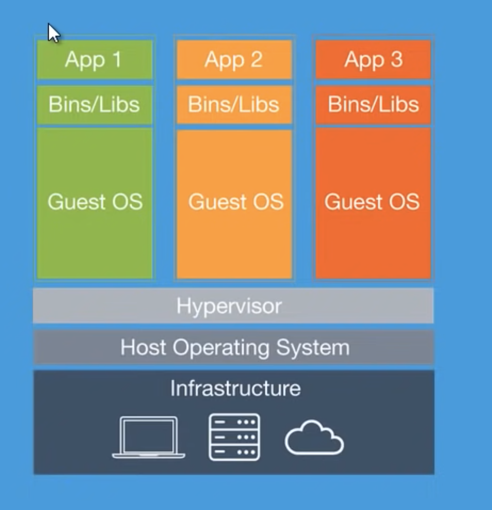
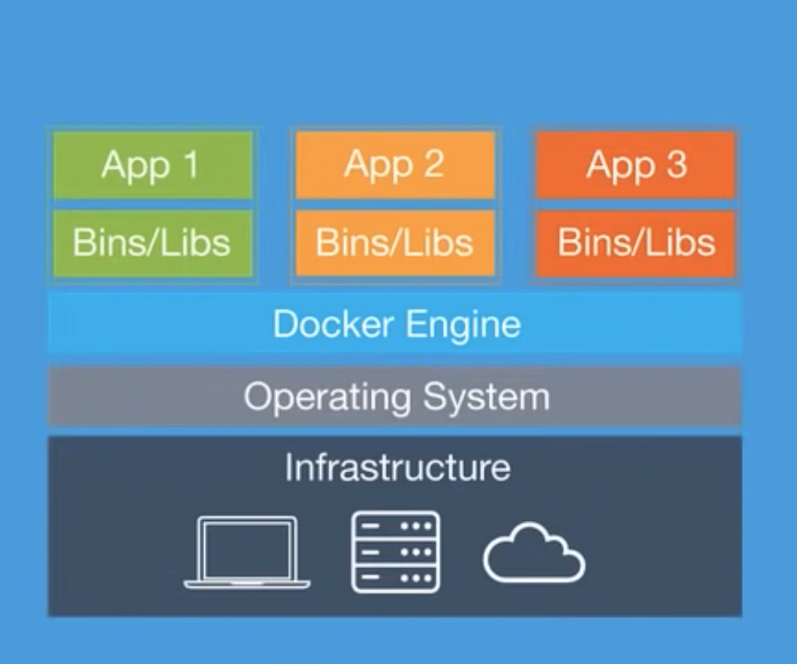

# Docker

Docker est un logiciel libre, il permet le déploiement d'applications dans des conteneurs. 
Il permet de créer (dans des conteneurs) une application avec ses dépendances, dans un conteneur isolé.
L'intérêt est qu'il pourra être exécuté (ce conteneur) sur n'importe quelle machine ou serveur.

## Installation

[docker Desktop](https://docs.docker.com/get-docker/)

## Introduction

- Les applications ont besoin de dépendances spécifiques. Docker est léger par rapport à une VM.
- On gagne en performance.
- On peut stopper et relancer des conteneurs.
- Facile d'utilisation (on n'a pas besoin d'être un expert en système).

Comment cela marche : avec une machine virtuelle ou directement dans un environnement Linux.

## VM



## Docker



## Dockerfile et docker-compose

C'est deux notions sont distinctes.

Un **Dockerfile** est un script (fichier) qui contient une série d'instructions permettant de créer une image Docker.

Dockerfile est utilisé pour **créer une image Docker unique**.

Attention à ne pas confondre avec **docker-compose**; docker-compose est utilisé pour **orchestrer** et gérer le déploiement d'applications composées de plusieurs services (conteneurs).

### Exemples

1. Dockerfile

```txt
# Utilisez une image de base Node.js LTS 20.10.0
FROM node:20.10.0

# Répertoir dans le conteneur
WORKDIR /app

# Copiez le package.json et le package-lock.json pour installer les dépendances
COPY package*.json ./

# Installez les dépendances
RUN npm install

# Copiez le reste des fichiers de l'application
COPY . .

# Commande pour démarrer l'application
CMD ["npm", "start"]
```

Le fichier docker-compose va orchestrer Node avec MongoDB par exemple, ce fichier est à placer dans le dossier courant de travail.

```txt
version: '3'
services:
  web:
    build:
      context: .
      dockerfile: Dockerfile
    ports:
      - "3001:3000"
    depends_on:
      - db
  db:
    image: "mongo:latest"
    ports:
      - "27017:27017"
```

Quelques détails :

- **services** définit les services de l'application ici deux web et db.

- **services web**
    - **build** construire une image à partir d'un fichier Dockerfile.
    - **context** spécifie le contexte de construction ici le répertoire courant "."
    - **dockerfile** indique le nom du fichier pour construire l'image unique.
    - **ports** mappe les ports 3000 du conteneur avec le port 3000 de l'hôte.
    - **depends_on** le service web dépend du service db dans l'exemple

- **services db**
    - **image: "mongo:latest"** utilise l'image distante officielle de Docker Hub

Quelques commandes utiles 

```bash
# hello-world récupérer une image du Docker Hub
docker pull hello-world
# Puis on l'exécute puis arrête le conteneur
docker run hello-world

# liste toutes les images 
docker image ls

# supprime une image avec son ID
docker image rm d1165f221234

# commande un peu magique (dangereuse) pour supprimer toutes les images none
docker image prune
# si la précédente ne marche pas, une commande un peu spécialisée
docker rmi $(docker images -a|grep "<none>"|awk '$1=="<none>" {print $3}')


# liste tous les conteneurs même arretés
docker ps -a
# supprime un conteneur avec son ID
docker rm 6d6e1ebf2098
# plus rapide premiers caractères de l'ID
docker rm 6d6
```

## Installation de PHP 8.3 avec apache

- Démarrez le projet en lançant le docker-compose

```txt
# lancer vos conteneurs 
docker-compose -f stack.yaml up

# en tache de fond
docker-compose -f stack.yaml up -d

# arrete et supprime les conteneurs
docker-compose -f stack.yaml down

# reconstruire l'image
docker-compose -f stack.yaml build

# relancer enfin
docker-compose -f stack.yaml up
```

- Se connecter aux différents conteneurs 

```bash
# lsiter l'ensemble des conteneurs en exécution 
docker ps 
# docker ps -a tous les conteneurs mêmes ceux qui sont arrêtés

# nom_du_projet correspond dans le fichier docker-compose au nom de l'image
docker exec -it [nom_du_projet]_php /bin/bash

# par exemple le nom du conteneur pour php est php
docker exec -it php /bin/bash
```

## Exercice 01 installation découverte 

- Fichier docker compose, une image avec apache, où l'on définit le port exposé 

```yml
version: '3'

services:
  php-apache:
    image: php:8.3-apache
    container_name: app_php
    ports:
      - "8888:80"
    volumes:
      - ./app:/var/www/html
```

Une fois connecté installer composer

```bash
curl -sS https://getcomposer.org/installer | php -- --install-dir=/usr/local/bin --filename=composer

# ça plante 
composer g require psy/psysh:@stable

# Dans le conteneur php installez avant
apt-get update && apt-get install -y zip unzip

# réinstaller psysh mais ça marche pas

# ajoute un lien symbolique /usr/local/bin
ln -s  /root/.composer/vendor/psy/psysh/bin/psysh psysh
```

## Personnaliser son image avec Dockerfile 

D'abord supprimer votre conteneur. 

```bash
docker rm app_php 
# ou si vous préférez arrete et supprime les conteneurs
docker-compose -f stack.yaml down
```

Changez le docker composer :

```yml
version: '3'

services:
  php-apache:
    container_name: app_php
    build:
      context: .
      dockerfile: Dockerfile
    ports:
      - "8888:80"
    volumes:
      - ./app:/var/www/html
```

- Le fichier Dockerfile 

```txt
FROM php:8.3-apache

# On peut également modifier les PATH
ENV PATH "$PATH:/root/.composer/vendor/bin"

# Composer
RUN apt-get update && apt-get install -y zip unzip
RUN curl -sS https://getcomposer.org/installer | php -- --install-dir=/usr/local/bin --filename=composer

# Installation de PsySH
RUN composer global require psy/psysh:@stable
```

## Installation de la base de données (MySQL)

```yml
version: '3'

services:
  php-apache:
    container_name: app_php
    build:
      context: .
      dockerfile: Dockerfile
    ports:
      - "8888:80"
    volumes:
      - ./app:/var/www/html

  db:
    image: mysql:latest
    container_name: app_mysql
    environment:
      - MYSQL_ROOT_PASSWORD=root
      - MYSQL_DATABASE=yams
      - MYSQL_USER=admin
      - MYSQL_PASSWORD=admin
```

```txt
FROM php:8.3-apache

# On peut également modifier les PATH
ENV PATH "$PATH:/root/.composer/vendor/bin"

# PDO
RUN docker-php-ext-install mysqli pdo pdo_mysql

# Composer
RUN apt-get update && apt-get install -y zip unzip
RUN curl -sS https://getcomposer.org/installer | php -- --install-dir=/usr/local/bin --filename=composer

# Installation de PsySH
RUN composer global require psy/psysh:@stable
```

## Exercice 02 hello world

- Affichez "Hello World" en PHP en utilisant la configuration que nous avons mis en place. Puis connectez à la base de données.

## Exercice 03 base de données

- Connectez vous à la base de données.

- Créez une table pastries et ajoutez quelques valeurs dans cette table.

Rappel pour se connecter au conteneur mysql ( voyez votre fichier yaml )

```bash
docker exec -it app_mysql /bin/bash
```

Connectez vous au conteneur MySQL puis créez la table ci-dessous :

    - id PK
    - name varchar(100)
    - price decimal(2,1)

```sql
CREATE TABLE `pastries` (
    `id` INT,
    `name` VARCHAR(20),
    `price` DECIMAL(10, 2) NOT NULL,
    CONSTRAINT pk_id PRIMARY KEY (`id`)
    ) ENGINE=InnoDB ;
```

Quelques commandes utiles pour se connecter au conteneur MySQL

```bash
# mysql -u admin -p
mysql> use yams # connexion à la base de données yams

# Créez la table 
```

Puis insérez quelques données à l'aide du code suivant :

```sql
INSERT INTO pastries (id, name, price) VALUES
  (1, 'Croissant', 2.50),
  (2, 'Eclair', 3.00),
  (3, 'Chocolate Croissant', 2.75),
  (4, 'Fruit Tart', 5.50),
  (5, 'Donut', 1.75);
```

## 04 Exercice variable d'environnement

- Installez des variables d'environnement, tout d'abord vous avez deux solutions soit vous installez la dépendances vlucas/phpdotenv directement dans le conteneur php (dans le projet app ), soit vous configurez votre fichier de build pour intégrer cette dépendance à la construction du conteneur.

```txt
RUN composer require vlucas/phpdotenv
```

Pour finir nous allons automatiser la création d'une base de données avec une table et des données, considérez ces commandes pour relancer vos conteneurs :

Ajoutez les lignes suivantes dans le fichier stack.yaml pour le service db, créez le fichier install.sql et écrivez le code pour installer la table avec les données.

```yaml
  db:
    image: mysql:latest
    container_name: app_mysql
    environment:
      MYSQL_ROOT_PASSWORD: root
      MYSQL_DATABASE: yams
      MYSQL_USER: admin
      MYSQL_PASSWORD: admin
    ports:
      - "3306:3306"
    volumes:
      - "./sql-scripts/install.sql:/docker-entrypoint-initdb.d/1.sql"
    restart: always
```

## 01 TP

Par équipe de 2/3 créez un environement pour utiliser SF et une base de données MySQL
